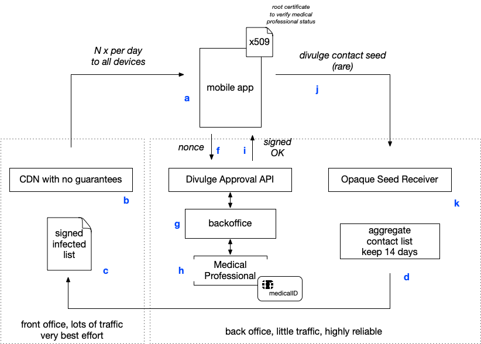
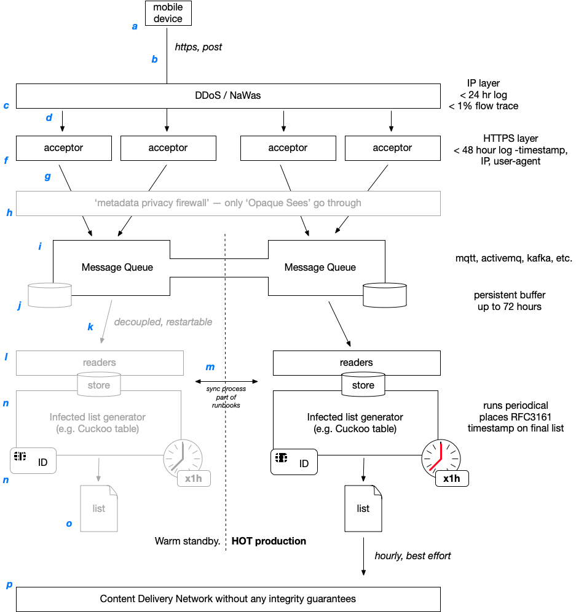

# Meta Architecture

Logical/abstract architecture - to help discuss the non-functional, information security and compliance aspects of any implementation. And help guide what needs to be arranged in terms of gouvernance.

## Overview

A Mobile app(a) installed on million of devices does regular (e.g. 1-4 times per day) fetches through a common Content Delivery Network (CDN), with no particular integrity or reliability guarantees (best effort).

Fetched is a digitally signed file (c) with the contamination details of the day. This file is generated by a very reliable central backend (d) and contains just the relevant information.

At some point (e.g. on a national scale, several 10's to 100's of time an hour) a medical professional will ask if his patient is willing to divulge his contact.

If so - some process is initiated in the backoffce (g) by a medical professional (h). 

The patients mobile (a) generates a nonce(f) which is then signed by the personal chipcard of the medical professional and returned to the phone (i).

Using the build in certificate; the mobile phone validates that the medical professional is licensed to practice (i.e. in the national registered of licensed medical professionals, with the right status and identified (these national registries also contain non-medical staff and `generic nameless card's).

The patent has then some sort of interaction and the phone sents (j) the opaque data to the central backend. Where (d) aggregates it regularly with the data of the past N days; and pushed it to the CDN (c) for publication. 

Where a phone (a) fetches it (b), runs through the list & informs the user of any new contact.

## Back office

The device(a) posts, using plain http(s)/REST, its opaque contact data. This is filtered, at pure IP level, by (c); where no data is kept but a short log and a few flows. 

It (d) arrives at a webserver (f) which publishes just the opaque contact data and nothing else onto a message bus(i).  This webserver keeps nothing but a normal HTTP log file with IP address and user agent; for < 48 hours. But keeps no payload data.

Conceptually this frontend is separated from the rest by (h).

The message queue then has a certain level of persistence (short lived), (j) to deal with short outages & peak demand.

At a slower rate, readers (l) take the messages of the queue (k) and store this into a store.

During outages; cold/warm/hot stores (m) may get synchronised between sites (the contact lists in all current designs allow for easy merging by simply putting one on top of the other).

At regular interval (n) aggregators prepare a list for distribution and get this digitally signed. The resulting file, (o) is then pushed to a content delivery network (with no integrity & just best effort guarantees).

