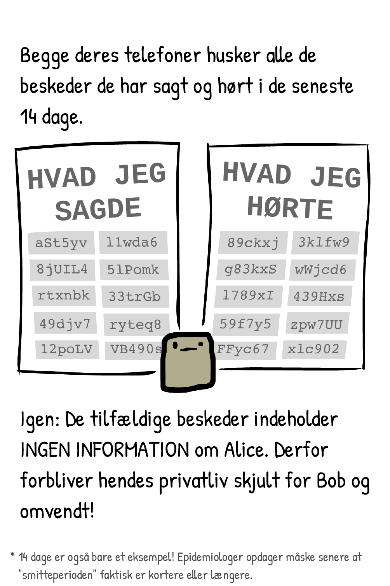
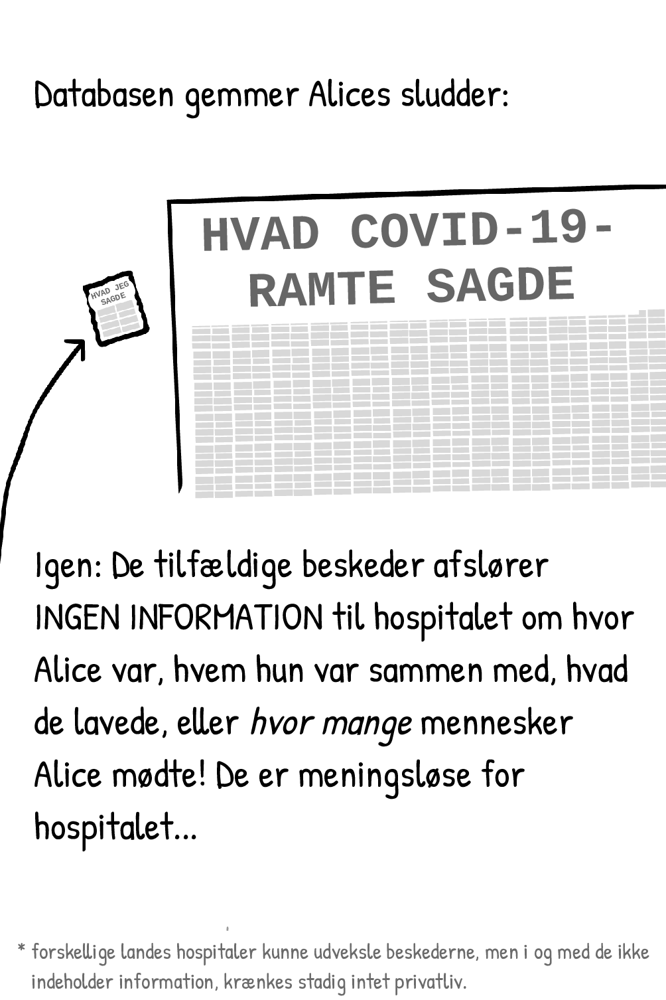

# Tegneserien på dansk

[Download tegneserien som PDF](comic-dk.pdf)

# Oversættelser

Denne tegneserie er allerede oversat til forskellige sprog. 
Den aktuelle liste findes på
https://github.com/DP-3T/documents/edit/master/public_engagement/cartoon/

Vi beder om hjælp med *Oversættelse af Tegneserien*! Hvis du sender din
oversættelse eller giver m.veale@ucl.ac.uk besked, integrerer vi den i
repositoriet, således at andre kan benytte dem. Vi vil sætte pris på hvis du
om muligt ligeledes vil benytte CC-0 licensen på din oversættelse.

Denne oversættelse blev startet af Jonas Bardino
(https://github.com/jonasbardino), og nåede sin endelige form med rettelser og
nyttige forslag fra Bente Olsen og Kasper Laudrup.

Yderligere kommentarer eller rettelser er velkomne via GitHub linket ovenfor.
Oversættelsen er som originalen gjort tilgængelig for alle under PUBLIC DOMAIN
/ CC-0 licensen.

# Andet

Tegneserien blev oprindeligt lavet af [Nicky Case](https://ncase.me/), for at
forklare hvordan DP-3T funktionerer til et bredere publikum. Den er fokuseret på
at kommunikere budskabet enkelt og klart snarere end en fuldstændig eksakt
gengivelse af protokollen. F.eks. er det i dem forenklede viste udgave ikke
muligt at vælge tidspunkterne for upload, sådan som den fuldstændige version med
"cuckoo filter" tillader (fra og med 8. april).

Den engelske originaludgave af tegneserien findes på https://ncase.me/contact-tracing/. 

Hele web-sitet er offentligt tilgængeligt under CC-0
 licensen, og ligeledes at [finde på GitHub](https://github.com/ncase/ncase.github.io).

Det er også vigtigt at understrege at tegneserien anviser aspekter, som går
udover selve specifikationerne i protokollen. Herunder f.eks.en risikovurdering
forbundet med instruktionerne om at blive hjemme. Det er således kun et eksempel
på hvordan en lokal risikoberegningsalgoritme kunne se ud.

Mens protokollen er designet til at beskytte privatlivets fred og hjælpe med at
beskytte en lang række friheder mod snigende funktionelle begrænsninger, kræver
den stadig omhyggelig og velovervejet brug i et konkret miljø. Der er brug for
grundigt gennemtænkte retningslinjer mhp at overholde
menneskerettighederne og sørge for at beskytte alle i vores samfund.
Tegneserien bør derfor ikke læses som DP-3T-holdets konkrete politiske
anvisninger, men begrænse sig til selve protokollen.
